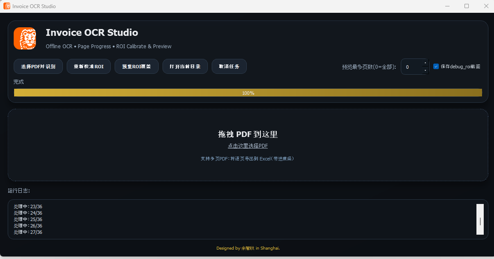
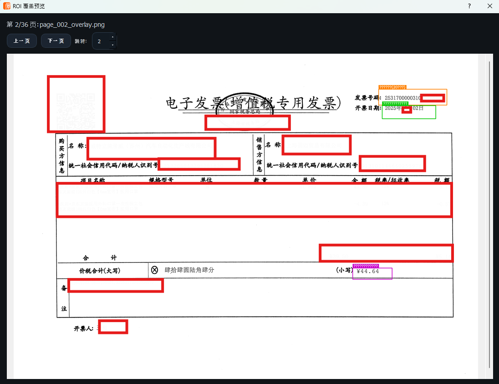

# 🧾 Invoice OCR Studio

<div align="center">

**一个功能强大的离线发票 OCR 桌面工具**

把 PDF 拖进来 → 程序逐页识别 → 自动导出 Excel 并打开

[](https://www.python.org/)
[](https://riverbankcomputing.com/software/pyqt/)
[](https://opencv.org/)

[📸 预览](#快速预览) • [🚀 快速开始](#安装与启动) • [📋 功能介绍](#核心功能) • [❓ 常见问题](#常见问题)

</div>

---

## 🎯 核心功能

<table>
  <tr>
    <td width="50%">
      <h3>✨ 主要特性</h3>
      <ul>
        <li>🎯 <strong>拖拽一键识别</strong> - 支持多页 PDF 批量处理</li>
        <li>📊 <strong>Excel 自动导出</strong> - 逐页一行，结构清晰</li>
        <li>⚙️ <strong>智能 ROI 校准</strong> - 自适应不同发票版式</li>
        <li>🔄 <strong>实时进度反馈</strong> - 按页更新进度，支持取消任务</li>
        <li>👁️ <strong>所见即所得预览</strong> - UI 内翻页验证识别框位置</li>
        <li>🌀 <strong>旋转纠正</strong> - 支持 0°/90°/180°/270° 自动调整</li>
      </ul>
    </td>
    <td width="50%">
      <h3>📦 导出字段</h3>
      <ul>
        <li>文件名</li>
        <li>页码</li>
        <li>票号 (20位)</li>
        <li>开票日期 (YYYYMMDD)</li>
        <li>价税合计</li>
        <li>票号完整性检验 (Y/N)</li>
      </ul>
    </td>
  </tr>
</table>

---

## 📸 快速预览

### 主界面演示


### ROI 覆盖预览


---

## 🚀 安装与启动

### 前置要求
- **Python 3.8+**
- **Windows/Linux/macOS**

### 第一步：环境准备

```bash
# 克隆或下载项目
git clone https://github.com/jimmyyuzhiqiu/invoice-ocr-studio.git
cd invoice-ocr-studio

# 创建虚拟环境（推荐）
python -m venv .venv

# 激活虚拟环境
# Windows:
.\.venv\Scripts\activate
# Linux/macOS:
source .venv/bin/activate

# 升级 pip
pip install -U pip
```

### 第二步：安装依赖

```bash
pip install PyQt5 PyMuPDF opencv-python numpy pandas openpyxl rapidocr onnxruntime
```

**依赖说明：**
- `PyQt5` - GUI 框架
- `PyMuPDF` - PDF 处理
- `opencv-python` - 图像处理
- `numpy/pandas` - 数据处理
- `openpyxl` - Excel 导出
- `rapidocr + onnxruntime` - 离线 OCR 识别

### 第三步：启动应用

```bash
python invoice_ui.py
```

---

## 📖 使用指南

### 🔧 首次使用：校准 ROI（重要！）

ROI (Region of Interest) 校准是确保识别准确的关键步骤。

**步骤如下：**

1. **点击 "重新校准ROI" 按钮**
   
2. **选择一份代表性的 PDF 文件**
   - 建议选择格式最标准的一份发票

3. **输入校准页码**
   - 从 1 开始编号
   - 选择版式最规范的页面

4. **选择旋转方向**
   | 方向 | 说明 |
   |------|------|
   | `0°` | 无旋转 |
   | `cw90` | 顺时针 90° |
   | `ccw90` | 逆时针 90° |
   | `180°` | 旋转 180° |
   - 💡 **发票内容横向排列** 一般选 `cw90`

5. **依次框选三个关键区域**
   - 📍 **票号区域** (20位纯数字，如：11800191123912345678)
   - 📅 **开票日期区域** (格式：YYYYMMDD)
   - 💰 **价税合计区域** (金额字段)

### 👁️ 预览 ROI 覆盖（强烈推荐）

在识别前验证框选位置：

1. **点击 "预览ROI覆盖" 按钮**
2. **在弹出��口翻页检查**
   - 绿框应准确覆盖发票字段
   - 框过小容易漏字，框过大容易识别错数据

3. **如发现偏移**
   - 定位到偏移最明显的页面
   - 使用该页重新校准一次

### 📥 执行识别与导出

1. **拖拽 PDF 文件到界面**
   - 或点击拖拽区域手动选择
   - 支持多个 PDF 批量处理

2. **等待进度条完成**
   - 实时显示进度：`当前页/总页数`
   - 支持中途点击"取消"停止任务

3. **自动导出 Excel**
   - 导出完成后自动打开文件
   - 每页数据一行，逐个字段清晰呈现

---

## 📁 项目文件结构

```
invoice-ocr-studio/
├── invoice_ui.py          # 📊 主GUI界面
├── invoice_cli.py         # ⚙️ CLI 子进程（执行识别、输出进度）
├── invoice_core.py        # 🧠 核心识别引擎逻辑
├── calibrate_roi.py       # 🔧 ROI 校准工具
├── app.ico                # 🎨 应用图标
├── ing-logo.png           # 🎨 Logo 资源
├── docs/images/           
│   ├── ui.png            # 主界面截图
│   └── ui-overlay.png    # ROI 预览截图
└── README.md             # 📖 项目文档
```

---

## 🔍 工作流程示意

```
┌─────────────────────┐
│  拖拽 PDF 文件      │
└──────────┬──────────┘
           ↓
┌─────────────────────────────────────┐
│  逐页处理（多进程）                 │
│  ├─ PDF 转图像                     │
│  ├─ 应用 ROI 框选                  │
│  ├─ OCR 文字识别（RapidOCR）      │
│  └─ 字段提取与验证                 │
└──────────┬──────────────────────────┘
           ↓
┌─────────────────────────────────────┐
│  数据整理与导出                     │
│  ├─ 构建表格数据                   │
│  └─ 生成 Excel 文件               │
└──────────┬──────────────────────────┘
           ↓
┌─────────────────────┐
│  自动打开 Excel    │
└─────────────────────┘
```

---

## ⚙️ 技术栈

| 组件 | 技术方案 | 说明 |
|------|---------|------|
| **GUI** | PyQt5 | 跨平台桌面应用框架 |
| **PDF 处理** | PyMuPDF | 高效的 PDF 页面转图像 |
| **图像处理** | OpenCV | 图像增强、ROI 提取 |
| **OCR** | RapidOCR | 离线、快速、准确的中文 OCR |
| **数据处理** | Pandas + NumPy | 数据结构化和计算 |
| **Excel 导出** | openpyxl | 灵活的 Excel 文件生成 |

---

## 💡 常见问题

### Q1: 识别不准确怎么办？
**A:** 首先检查 ROI 框位置：
- 点击"预览ROI覆盖》，确保绿框准确覆盖发票字段
- 如果偏移，用偏移最明显的页面重新校准一次
- 不同版式的发票可能需要分别校准

### Q2: 支持哪些 PDF 格式？
**A:** 支持标准的 PDF 文件，包括：
- 扫描版 PDF（图像型）✅
- 文本型 PDF （可能需要调整）
- 混合 PDF

### Q3: 处理大文件 (100+ 页) 会很慢吗？
**A:** 
- 速度取决于 PDF 分辨率和硬件配置
- 一般 1 页约耗时 2-5 秒（包括 OCR）
- 可点击"取消"随时停止任务

### Q4: 导出的 Excel 可以自定义吗？
**A:** 当前固定导出默认字段，如需自定义，可编辑 `invoice_core.py` 中的字段定义部分。

### Q5: 支持离线使用吗？
**A:** **完全离线！** 🎉
- RapidOCR 模型本地加载
- 不需要网络连接和 API 密钥
- 所有处理都在本地完成，数据安全

---

## 📝 许可证

MIT License - 欢迎自由使用和修改！

---

<div align="center">

### 💬 反馈与改进

如遇问题或有建议，欢迎提 Issue 或 PR！

**Designed by 余智秋 in Shanghai** 🌆

</div>